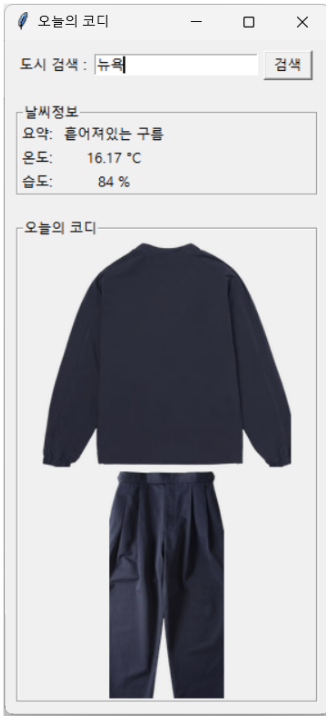
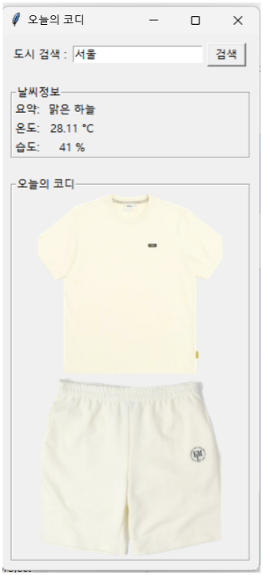

# 날씨 기반 옷 추천 (Flask + Tkinter)

OpenWeatherMap의 현재 날씨(한글 설명)와 온도를 불러와 **기온(기본 20°C)** 기준으로 상·하의 이미지를 랜덤 추천하는 데스크톱 앱입니다.  
이 레포에는 주피터 노트북으로 실행하는 `server.ipynb`(Flask) / `client.ipynb`(Tkinter)가 포함됩니다.

## 폴더
project11/ # 의상 PNG 이미지들
server.ipynb # 서버 노트북
client.ipynb # 클라이언트 노트북

  
  

